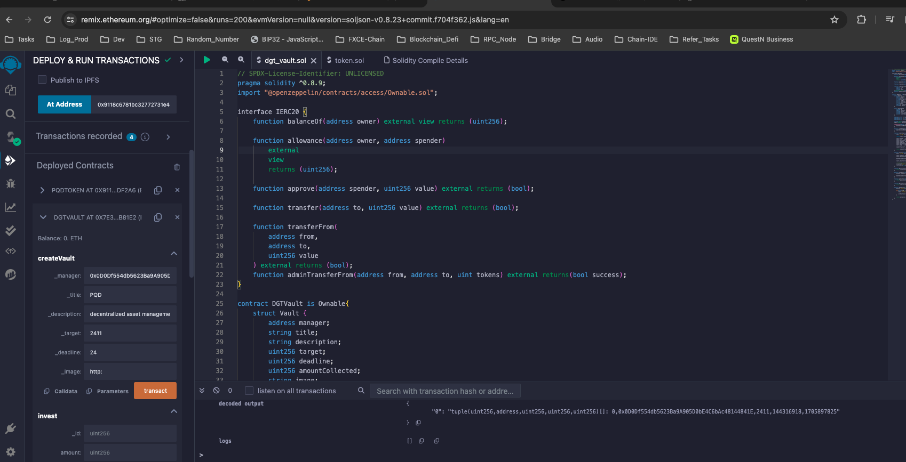
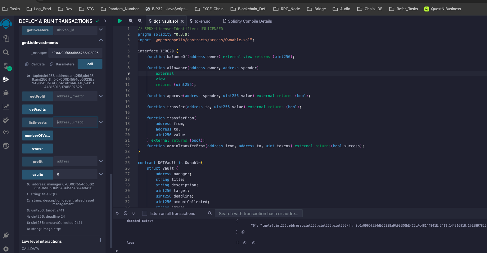
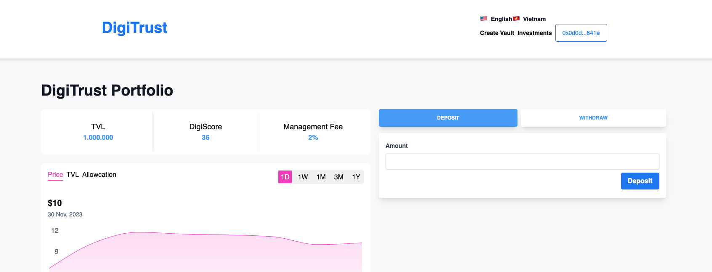
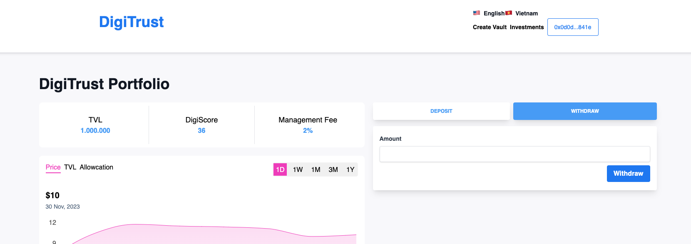
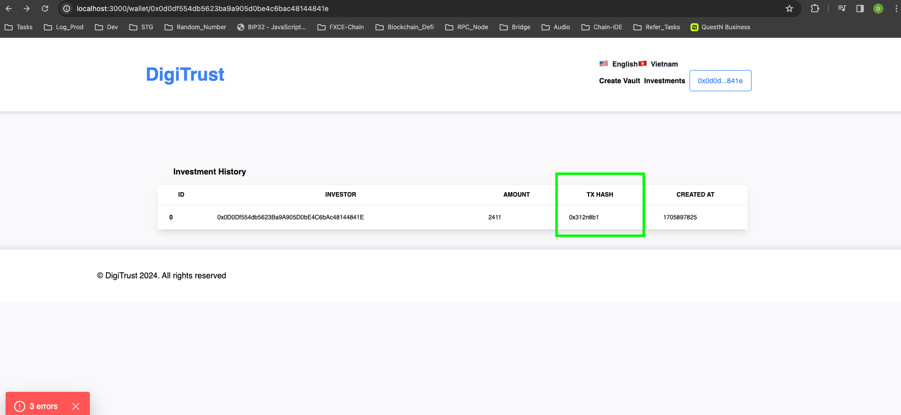

# DigiTrust

DigiTrust is the decentralized social finance (DeSoFi) protocol, which leverages blockchain technology to create a decentralized ecosystem where users can seamlessly engage in various financial activities within a social context

## Getting Started

Run the development server:

```bash
npm install
npm run dev
```
Open [http://localhost:3000](http://localhost:3000) with your browser to see the result.

## How to use 
### 1 - Create vault to raise funding 

### 2 - Check vault information and list of investments

### 3 - Make investment

### 4 - Withdraw profit

### 5 - Check transaction hash


## FAQ
### 1 - DigiTrust deployed to Klaytn Baobab testnet
### 2 - DigiTrust token: 0x9118c6781bc32772731e4e4777698d4c97cdf2a6
### 2 - DigiTrust contract: 0x7e3Eb852b7cC65477e50cdc8DD51cf1B36fB81E2
